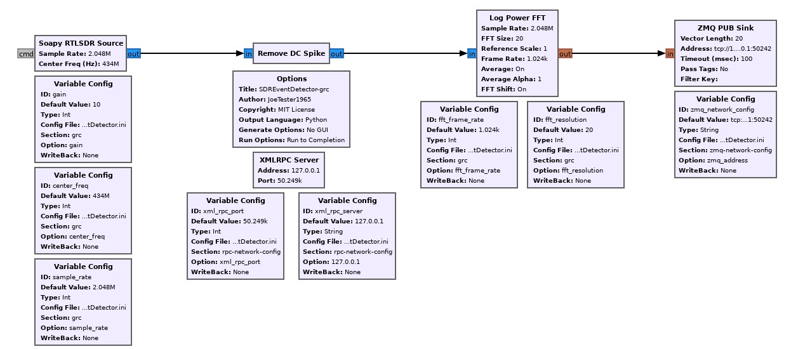
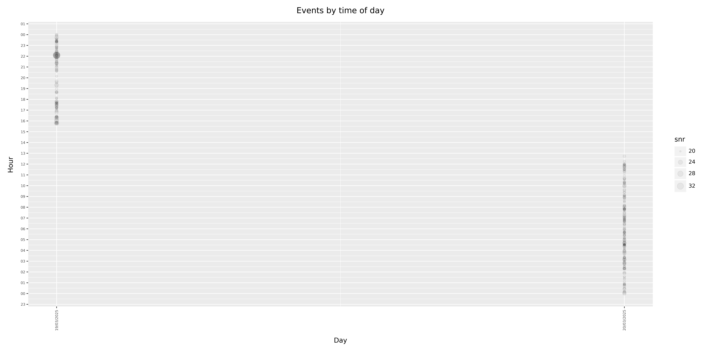
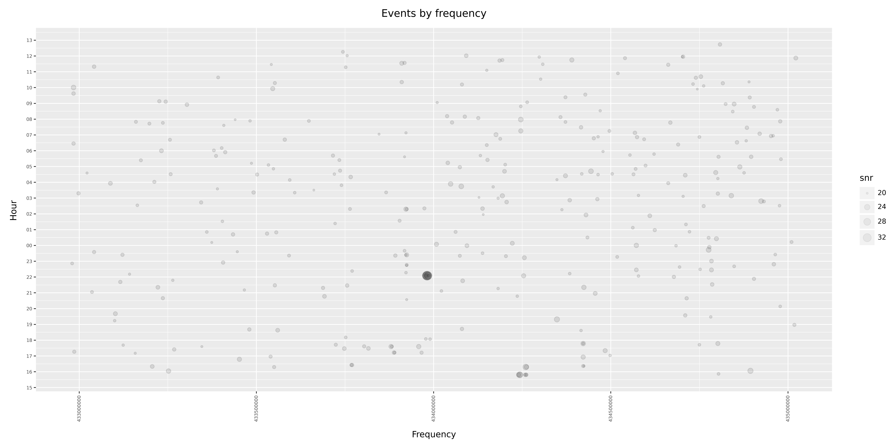
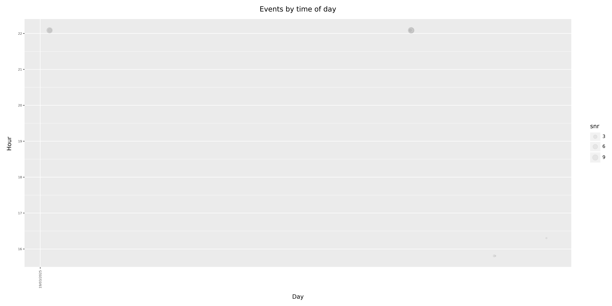
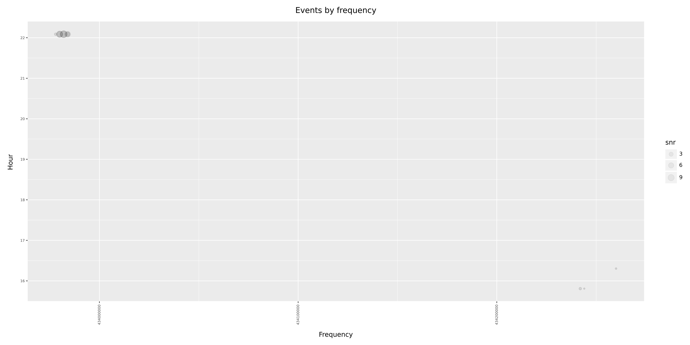

# SDREventDetector

Log, message and graph simple SDR derived local events such car key fobs being pressed and  mobile phones transmitting within the range of your RTL SDR.

Does this by taking a FFT of your radio data, finding the average power in a given band over a specified time interval and then creating an event where there is a gain increase greater than the given threshold.

# Installation

Tested on Pi Debian Bookwork 64bit 2024-03-15.

```console
sudo apt-get update 
sudo apt-get upgrade
sudo apt-get install cmake gnuradio python3-dev python3-paho-mqtt ffmpeg
python3 -m venv venv
source venv/bin/activate
pip3 install plotnine
deactivate
chmod u+x start.sh stop.s visualise.sh
sudo apt-get install rtl-sdr
```

Note: a python venv is needed for visualisation scripts as plotnine install can muck up gnuradio.

# Design

Used gnuradio companion to create a simple flowgraph that allows fft output from the radio to be configured and consumed by a seperate python program. 



The python program [zmqpubsink.py](.\zmqpubsink.py) produces events from this as defined by your [configuraion file](SDREventDetector.ini):

- Creates a csv file of events for further analysis and visualisation.
- Optionally sends events to your messaging server.

# Configuration file

Edit the [config file](SDREventDetector.ini) to adjust the following which has been configured to look for car key fobs at 433 MHz.

| Key | Notes |
| :----: | :--- |
| centre_freq | Where to tune your radio. |
| gain | What gain your radio needs. |
| sample_rate | Sample rate for your radio .|
| fft_resolution | How many bands to split the signal up into. Must be a power of 2 e.g 512, 1024 or 2048. Too high a value will cause peformance issues and error logs.|
| fft_frame_rate | How often the fft is updated. Use a higher value for signals only present for a short time. Too high a value will cause peformance issues and error logs. |
| zmq_address | Leave unless have adress conflict or remote networked radio. |
| xml_rpc_port | Leave unless have adress conflict. |
| xml_rpc_server | Leave unless have adress conflict  or remote networked radio. |
| seconds_to_buffer | Leave default unless have specialist needs for gain detection or performance problems |
| trigger_gain_threshold | Tune to what is requred by your applicaiton to generate sensible events |
| mqtt_ip_address | Only use mqtt section if you have a messaging server |
| mqtt_username | .. |
| mqtt_password | .. |
| mqtt_topic | .. |


# Starting and stopping

```console
bash start.sh
```

```console
bash stop.sh
```

# Example output

A real-time csv file is created with event information:

***timestamp-utc,frequency,power,snr***


```console
pi@ShedPi:~/Documents/SDREventDetector $ tail -f SDREventDetector.csv 
1742471097.7432244,434390000,-38.47,21.75
1742471506.126904,434540000,-39.27,20.50
1742471534.4082444,435022000,-41.92,21.41
1742471766.2127216,434298000,-38.18,20.13
1742471842.0531104,434702000,-37.39,20.05
1742471842.0537055,434704000,-36.65,20.77
1742472059.3957329,434092000,-43.50,21.06
1742472071.9372394,433756000,-42.16,20.06
1742472946.1153631,433744000,-39.25,20.33
1742474639.9456496,434808000,-39.86,20.80
```

# Visualisation

```console
bash ./visualise.sh /tmp
```

Files like below will be stored in /tmp






Note that is there are too many events here for your liking, you can edit the command used by visualise.sh to increase the cutoff power before events are visible e,g,

```console
python3 ./csv_viewer.py $CSV_FILE 24.0
```
rather than

```console
python3 ./csv_viewer.py $CSV_FILE 0.0
```

Giving this instead:





Enjoy!

